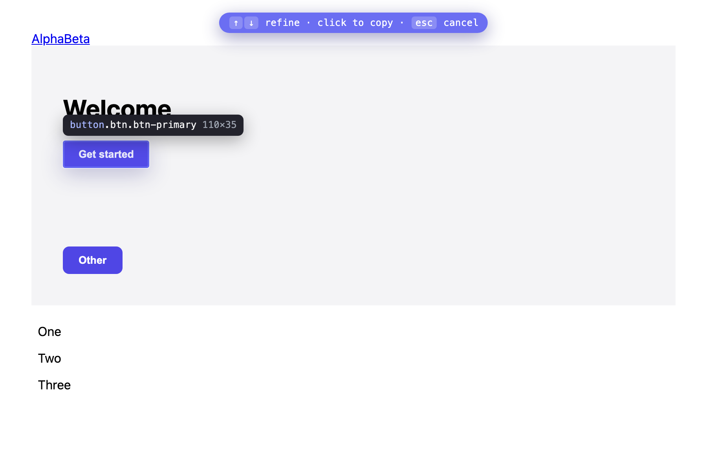

# Pluck

**Hit a hotkey, click any element, and a Claude-Code-ready description of it lands on your clipboard.**

Pluck is a tiny Chromium extension for the AI-assisted design loop. Instead of opening DevTools → Inspect → reading the class → copying it into your agent, you press one shortcut, click the element, and paste. The clipboard gets a verified-unique CSS selector plus just enough context for Claude Code to pinpoint the element in source.



## Install (load unpacked)

1. Open `chrome://extensions` (works in Chrome, Edge, Brave, Arc).
2. Toggle **Developer mode** on (top-right).
3. Click **Load unpacked** and select this folder (the one containing `manifest.json`).
4. (Optional) Pin Pluck to the toolbar.

The default shortcut is **⌘⇧E** (macOS) / **Ctrl+Shift+E** (Windows/Linux). Change it at `chrome://extensions/shortcuts`.

## Use

1. On any page, press **⌘⇧E** (or click the toolbar icon → **Start inspecting**).
2. Move the mouse — the element under the cursor is highlighted with its `tag.class#id · W×H`.
3. Refine if needed: **↑** selects the parent, **↓** the first child.
4. **Click** (or **Enter**) to copy. A toast confirms. **Esc** cancels.
5. Paste into Claude Code.

### What gets copied

Pick a format in the popup (default is **+ Context**):

**Selector only**
```
main > section.hero > div.cta > button.btn.btn-primary
```

**+ Context** (recommended)
```
button.btn.btn-primary  ·  "Get started"
selector: main > section.hero > div.cta > button.btn.btn-primary
<button class="btn btn-primary" type="button">Get started</button>
```

**Full** — adds key computed styles (`color`, `background`, `font`, `padding`, `border-radius`) for "make this match" prompts.

The popup also keeps your **last 10 plucks** — click any to copy it again.

## How it works

| Piece | Role |
|---|---|
| `src/background/service-worker.js` | Listens for the hotkey / popup request, injects the content scripts into the active tab via `chrome.scripting`, stores capture history. |
| `src/content/selector.js` | Pure selector engine. Builds a `querySelectorAll`-verified unique selector; climbs ancestors and adds `:nth-of-type` only as needed; drops machine-generated junk classes (`css-1a2b3c`, `sc-…`, `jsx-…`). |
| `src/content/format.js` | Pure formatter: element facts → clipboard string, per mode. |
| `src/content/inspector.js` | The inspect-mode controller: a Shadow-DOM overlay, capture-phase event handling (so the page never reacts to the selection click), clipboard write, toast. |
| `src/content/styles.js` | Overlay styles (adopted into the shadow root). |
| `src/popup/*` | Format toggle, hotkey reminder, copy history. |

**Permissions:** `scripting`, `storage`, and `host_permissions: <all_urls>`. The broad host access is deliberate: it's what lets the keyboard shortcut inject on the **first** press on any site. (The leaner `activeTab` only grants page access *after* you click the icon / open the popup, so a cold shortcut press silently did nothing — see the note below.) No network is used; nothing leaves your machine — Pluck only reads the DOM when you invoke it.

## Develop

```bash
npm install            # dev deps: jsdom (unit), playwright (integration)
npm run icons          # regenerate PNG icons from scripts/make-icons.js
npm run check          # manifest + icon + JS syntax validation
npm test               # unit tests: selector engine, formatter, service worker

# real-browser integration (needs a static server):
python3 -m http.server 8753 &
npm run test:e2e       # overlay, selection, nth-of-type, SVG, clipboard, click-suppression
```

No build step — it's vanilla JS/CSS/HTML, loadable unpacked as-is.

## Roadmap

- Companion menu-bar app for a true global (cross-app) hotkey.
- Custom format templates.
- "Copy as screenshot + selector" for visual prompts.
- Multi-select (pluck several elements into one block).
