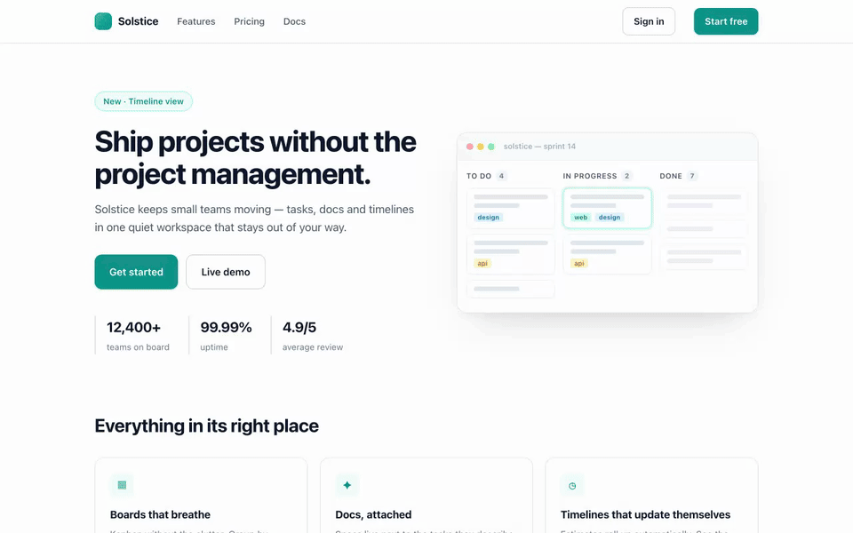

<div align="center">

# Pluck

**Hit a hotkey, click any element, and a Claude-Code-ready description of it lands on your clipboard.**

[](https://github.com/william-laverty/pluck/actions/workflows/ci.yml)
[](CHANGELOG.md)
[](LICENSE)
[](PRIVACY.md)

[Website](https://getpluck.vercel.app) · [Install](#install) · [How it works](#how-it-works) · [Privacy](PRIVACY.md) · [Contributing](CONTRIBUTING.md)



</div>

## Why

When you build web UI with an AI coding agent, you spend all day telling it *which element you mean*. The loop today: open DevTools → Inspect → read the class soup → copy it → paste it → describe it anyway. Five steps, dozens of times a session.

Pluck makes it one gesture. Press the shortcut, click the element, paste. The clipboard gets a **verified-unique CSS selector** plus just enough context for Claude Code (or any agent) to pinpoint the element in your source.

## Install

**Chrome Web Store** — *submission in progress; the packaged zip ships from CI in the meantime.*

**Load unpacked** (Chrome, Edge, Brave, Arc — any Chromium with MV3):

1. Clone or [download](https://github.com/william-laverty/pluck/archive/refs/heads/main.zip) this repo.
2. Open `chrome://extensions`, toggle **Developer mode** (top right).
3. Click **Load unpacked** and select the repo root (the folder with `manifest.json`).
4. Optionally pin Pluck to the toolbar.

> After installing or reloading the extension, **already-open tabs need one refresh** to pick up the in-page shortcut (new tabs work immediately). The toolbar **Start inspecting** button works on open tabs without a refresh.

## Use

| | |
|---|---|
| **⌘⇧E** / **Ctrl+Shift+E** | toggle inspect mode (record any combo in the popup) |
| **mouse** | the element under the cursor is highlighted with `tag.class#id · W×H` |
| **↑ / ↓** | refine — select the parent / first child without precision mousing |
| **click** or **Enter** | copy it. A toast confirms what you got |
| **Esc** | cancel |

The popup keeps your **last 10 plucks** — click any to copy it again.

### What gets copied

Pick a format in the popup (default **+ Context**):

**Selector** — just the verified-unique selector:

```
button.btn.btn-primary
```

**+ Context** *(recommended)* — adds the element's text and opening tag, so your agent can grep for it:

```
button.btn.btn-primary  ·  "Get started"
selector: button.btn.btn-primary
<button class="btn btn-primary">Get started</button>
```

**Full** — adds key computed styles, for "make this match" prompts:

```
button.btn.btn-primary  ·  "Get started"
selector: button.btn.btn-primary
<button class="btn btn-primary">Get started</button>
styles: color:#ffffff; background:#0d9488; font:600 15px/1.6 -apple-system; padding:13px 22px; border-radius:11px
```

## How it works

**The shortcut is handled in-page, not by the browser.** Pluck's content scripts are *declared* in the manifest, so the inspector and its keydown listener are already on every page before you press anything — no service-worker wake-up, no `activeTab` race. That's why the shortcut fires on the **first press**, on any site, even in browsers where extension commands are unreliable (looking at you, Arc).

**The selection click never reaches the page.** All inspect-mode events are intercepted in the capture phase, so you can pluck a link or a submit button without navigating or submitting. The overlay lives in a Shadow DOM at maximum z-index, defended against hostile page CSS.

**Selectors are verified, not guessed.** The engine ([`selector.js`](src/content/selector.js)):

- confirms uniqueness against the live DOM — `querySelectorAll` must match exactly one node;
- anchors on a stable `#id` when one exists, climbs ancestors and adds `:nth-of-type()` *only* when needed to disambiguate;
- filters machine-generated junk classes (`css-1a2b3c`, `sc-bdVaJa`, `jsx-1234`, hashy/hex tokens) while keeping real names like `editorContent`;
- preserves SVG/MathML tag case (`linearGradient` would match nothing lowercased) and CSS-escapes every identifier.

| Piece | Role |
|---|---|
| [`src/content/shortcut.js`](src/content/shortcut.js) | In-page `keydown` listener — detects the combo, toggles inspect mode directly |
| [`src/content/inspector.js`](src/content/inspector.js) | Inspect-mode controller: Shadow-DOM overlay, capture-phase events, clipboard, toast |
| [`src/content/selector.js`](src/content/selector.js) | Pure selector engine (node-testable, no DOM/chrome deps) |
| [`src/content/format.js`](src/content/format.js) | Pure formatter: facts → clipboard string per mode |
| [`src/content/styles.js`](src/content/styles.js) | Overlay styles, adopted into the shadow root |
| [`src/background/service-worker.js`](src/background/service-worker.js) | Toolbar button + capture history (`chrome.storage.local`) |
| [`src/popup/`](src/popup/) | Format toggle, shortcut recorder, last-10 history |

## Privacy

**Nothing leaves your machine.** No network, no analytics, no accounts — the architecture makes collection impossible, not just disallowed. Pluck reads the DOM only at the moment you invoke it and stores three things locally: your format preference, your custom shortcut, and your last 10 captures. Full policy: [PRIVACY.md](PRIVACY.md).

Permissions are minimal and gate-checked in CI: `scripting` (fallback injection into pre-install tabs), `storage` (the three items above), `host_permissions: <all_urls>` (so the shortcut listener is already present everywhere — the reliability feature). `scripts/check.js` fails the build if anything else sneaks in.

## Develop

No build step — it's vanilla JS/CSS/HTML, loadable unpacked as-is.

```bash
npm install            # dev deps: jsdom (unit), playwright (e2e)
npm run check          # static gate: manifest, icons, syntax, permission allowlist
npm test               # unit: selector engine, formatter, service worker
npm run package        # dist/pluck-v<version>.zip, store-ready

# real-browser integration (needs a static server):
python3 -m http.server 8753 &
npm run test:e2e       # overlay, selection, nth-of-type, SVG, clipboard, click-suppression
node scripts/store-assets.js   # regenerate store screenshots + README gif
```

See [CONTRIBUTING.md](CONTRIBUTING.md) for the ground rules (the short version: keep it dependency-free, keep it pure, keep it offline) and [CLAUDE.md](CLAUDE.md) for the architecture map.

## Roadmap

- Companion menu-bar app for a true global (cross-app) hotkey
- Custom format templates
- "Copy as screenshot + selector" for visual prompts
- Multi-select — pluck several elements into one block

## License

[MIT](LICENSE) © 2026 William Laverty
